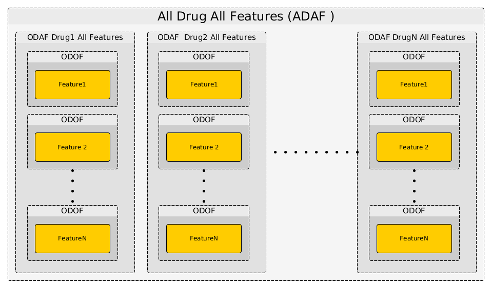

.. _anova_partone:

ANOVA analysis (introduction)
===============================

Although we provide a :ref:`standalone` called **gdsctools_anova**, the most up-to-date and flexible way of using **GDSCTools** is to use the library from an :term:`IPython` shell. This method (using IPython shell) is also the only way to produce :ref:`data_packages`.

In this section we will exclusively use Python commands, which should also be of interest if you want to look at the :ref:`notebooks` section later. 

We assume now that (i) you have **GDSCtools** installed together with :term:`IPython`. If not, please go back to the :ref:`installation` section. (ii) you are familiar with the INPUT data sets that will be used hereafter.

.. index:: IPython

.. note:: Beginners usually enter in an Python shell (typing python). 
    Instead, we strongly recommend to use IPython, which is a more flexible
    and interactive shell. To start IPython, just type this
    command in a terminal::

        ipython

    You should now see something like::

        Python 2.7.5 (default, Nov  3 2014, 14:33:39)
        Type "copyright", "credits" or "license" for more information.

        IPython 4.0.0 -- An enhanced Interactive Python.
        ?         -> Introduction and overview of IPython's features.
        %quickref -> Quick reference.
        help      -> Python's own help system.
        object?   -> Details about 'object', use 'object??' for extra details.

        In [1]:

.. note:: All snippets in this documentation are typed within IPython shell.
    You may see >>> signs. They indicate a python statement typed in
    a shell. Lines without those signs indicate the output of the previous
    statement. For instance::

        >>> a = 3
        >>> 2 + a
        5

    means the code **2 + a** should print the value 5

.. index:: IC50

The IC50 input data
-------------------------------

Before starting, we first need to get an IC50 data set example. Let us use this
:download:`IC50 example <../gdsctools/data/test_IC50.csv>` test file.

.. seealso:: More details about the data format can be found in the :ref:`data` section as well as links to retrieve IC50 data sets.

In Python, one can easily import all functionalities available in **GDSCTools** as follows::

    from gdsctools import *

Although this syntax is correct, in the following we will try to be more explicit. So, we would rather use::

    from gdsctools import IC50

This is better coding practice and has also the advantage of telling beginners
which functions are going to be used.

Here above, we imported the :class:`~gdsctools.readers.IC50` class that is required to read the example file aforementioned. Note that this IC50 example is installed with **GDSCTools** and its location can be obtained using::

    from gdsctools import ic50_test
    print(ic50_test.filename)

The :class:`~gdsctools.readers.IC50` class is flexible enough that you can provide the filename location or just the name **ic50_test** as in the example below, and of course the filename of a local file would work as well::

    >>> from gdsctools import IC50, ic50_test
    >>> ic = IC50(ic50_test)
    >>> print(ic)
    Number of drugs: 11
    Number of cell lines: 988
    Percentage of NA 0.206569746043

As you can see you can get some information about the IC50 content (e.g.,
number of drugs, percentage of NaNs) using the :ref:`print` function. See :class:`gdsctools.readers.IC50` and :ref:`data` for more details.

.. index:: help

Getting help
---------------

At any time, you can get help about a **GDSCTools** functionality or a python function by adding question tag after a function's name::

    IC50?

With **GDSCTools**, we also provide a convenience function called :func:`~gdsctools.gsdctools_help`::

    gdsctools_help(IC50)

that should open a new tab in a browser redirecting you to the HTML help version (on `ReadTheDoc website <gdsctools.readthedocs.org>`_) of a function or class (here the :class:`IC50` class).

.. index:: anova, drug, cell lines, genomic features

The ANOVA class
----------------

One of the main application of **GDSCTools** is based on an ANOVA analysis that is used to identify significant associations between drug and genomic features. As mentionned above, a first file that contains the IC50s is required. That file contains experimentall measured IC50s for a set of :math:`N_d` drugs across :math:`N_c` cell lines. The second data file is a binary file that contains various features across the same cell lines. Those :math:`N_f` features are usually of genomic types (e.g., mutation, CNA, Methylation). A default set of about 50 genomic features is provided and automatically fetched in the following examples. You may also provide your own data set as an input.

The default :download:`genomic feature file <../gdsctools/data/genomic_features.tsv.gz>` is downloadable and its location can be found using::

    from gdsctools import datasets
    gf =  datasets.genomic_features 

.. seealso:: More details about the genomic features data format can be found in the :ref:`data` section.

The class of interest :class:`~gdsctools.anova.ANOVA` takes as input a compulsary IC50
filename (or data) and possibly a genomic features filename (or data). Using 
the previous IC50 test example, we can create an ANOVA instance as follows::

    from gdsctools import ANOVA, ic50_test
    an = ANOVA(ic50_test)

Again, note that the genomic features is not provided, so the default file
aforementionned will be used except if you provide a specific genomic 
features file as the second argument::

    an = ANOVA(ic50_test, "your_genomic_features.csv")

There are now several possible analysis but the core of the analysis consists
in taking One Drug and One Feature (:term:`ODOF` hereafter) and to compute the
association using a regression analysis (see :ref:`regression` for details).
The IC50 across the cell lines being
the dependent variable :math:`Y` and the explanatory variables denoted :math:`X` are made of tissues, :term:`MSI` and one genomic feature. Following the regression analysis, we compute the ANOVA summary leading to a p-value for the significance of the association between the drug's IC50s and the genomic feature considered. This calculation is performed with the :meth:`~gdsctools.anova.ANOVA.anova_one_drug_one_feature` method.

We will see a concrete example in a minute. Once an :term:`ODOF` is computed, one can
actually repeat the :term:`ODOF` analysis for a given drug across all features using the :meth:`~gdsctools.anova.ANOVA.anova_one_drug` method. This is also named One Drug All Feature case (:term:`ODAF`). Finally we can even extend the analysis to All Drugs All Features (:term:`ADAF`) using :meth:`~gdsctools.anova.ANOVA.anova_all`.

.. index:: multiple testing

The following image illustrates how those 3 methods interweave together like
Russian dolls.

The computational time is therefore increasing with the number of drugs and
features. Let us now perform the analysis for the 3 different cases.

.. index:: ODOF

One Drug One Feature (ODOF)
~~~~~~~~~~~~~~~~~~~~~~~~~~~~~

Let us start with the first case (:term:`ODOF`). User needs to provide a drug and a feature name and to call the :meth:`~gdsctools.anova.ANOVA.anova_one_drug_one_feature` method. Here is an example:

.. plot::
    :include-source:

    from gdsctools import ANOVA, ic50_test
    gdsc = ANOVA(ic50_test)
    gdsc.anova_one_drug_one_feature(1047, 'TP53_mut', show=True)

Setting the :attr:`show` parameter to True, we created a set of 3 boxplots that is one for each explanatory feature considered: tissue, :term:`MSI` and genomic feature.

If there is only one tissue, this factor is included in the explanatory variable is not used (and the corresponding boxplot not produced). Similarly, the :term:`MSI` factor may be ignored if irrelevant.

In the first boxplot, the feature factor is considered;  we see the IC50s being divided in two populations (negative and positive features) where all tissues are mixed.

In the second boxplot, the tissue variable is explored; this is a decomposition
of the first boxplot across tissues.

Finally, the third boxplot shows the impact of the :term:`MSI` factor. Here again, all tissues are mixed. In the MSI column, zeros and ones correspond to MSI unstable and stab le, respetively. The **pos** and **neg** labels correspond to the feature being true or not, respetively.

The output of an :term:`ODOF` analysis is a time series that contains statistical information about the association found between the drug and the feature. See for :class:`gdsctools.anova_results.ANOVAResults` for more details.

If you want to repeat this analysis for all features for the drug **1047**,
you will need to know the feature names. This is stored in the following
attribute::

    gdsc.feature_names

The best is to do it in one go though since it will also fill the FDR correction column based on all associationa computed.

.. seealso:: :class:`gdsctools.anova` and :ref:`data_packages`.

.. index:: ODAF, signed effects, cohens

One Drug All Features (ODAF)
~~~~~~~~~~~~~~~~~~~~~~~~~~~~~~~~

Now that we have analysed one drug for one feature, we could repeat the analysis for all features. However, we provide a method that does exactly that for us  (:meth:`~gdsctools.ANOVA.anova_one_drug`):

.. plot::
    :include-source:

    from gdsctools import ANOVA, ic50_test
    gdsc = ANOVA(ic50_test)
    results = gdsc.anova_one_drug(999)
    results.volcano()

In a python shell, you can click on a dot to get more information.

Here, we have a different plot called a volcano plot provided in
the :mod:`gdsctools.volcano` module. Before explaining it, let us 
understand the x and y-axis labels. 

Each row in the dataframe produced by anova_one_drug() is made of a 
set of statistical metrics (look at the header **results.df.columns**).
It includes a p-value (coming from the ANOVA analysis) and a 
signed effect size can also be computed as follows.

In the ANOVA analysis, the population of IC50s is split into positive and
negative sets (based on the genomic feature). The two sets are denoted :math:`IC50_{pos}` and :math:`IC50_{neg}`. Then, the signed effect size :math:`\eta` is computed as follows:

.. math::

    \eta = \rm{sgn} ( \Delta) * Es(IC50_{pos}, IC50_{neg})

where

.. math::

    \Delta = \overline{IC50_{pos}} - \overline{IC50_{neg}}

and  :math:`Es` is the effect size function based on the Cohens metric (see
:func:`gdsctools.stats.cohens`).

In the volcano plot, each drug vs genomic feature has a p-value. Due to the increasing number of possible tests, we have more chance to pick a significant hit by pure chance. Therefore, p-values are corrected using a multiple testing correction method (e.g., BH method). The column is labelled :term:`FDR`. Significance of associations should therefore be based on the FDR rather than p-values. In the volcano plot, horizontal dashed lines (red) shows several FDR values and the values are shown in the right y-axis. Note, however that in this example there is no horizontal lines. Indeed, the default value of 25% is well above the limits of the figure telling us that there is no significant hits.

Note that the right y-axis (FDR) is inversed, so small FDRs are in the bottow
and the max value of 100% should appear in the top. 

.. note:: P-values reported by the :term:`ODOF` method need to be
    corrected using multiple testing correction. This is done
    in the the :term:`ODAF` and :term:`ADAF` cases.
    For more information, please see the
    :meth:`gdsctools.stats.MultipleTesting` description.

.. index:: ADAF

All Drug All Features (ADAF)
~~~~~~~~~~~~~~~~~~~~~~~~~~~~~

Here we compute the associations across all drugs and all features.
In essence, it is the same analysis as the :term:`ODAF` case but with more tests.

In order to reduce the computational time, in the following example,
we restrict the analysis to the breast tissue
using :meth:`~gdsctools.anova.ANOVA.set_cancer_type` method. This would
therefore be a **cancer-specific analysis**. If all cell lines are kept, this is a :term:`PANCAN` analysis. The information about tissue is stored in the genomic feature matrix in the column named **TISSUE_FACTOR**.

.. plot::
    :include-source:

    from gdsctools import ANOVA, ic50_test
    gdsc = ANOVA(ic50_test)
    gdsc.set_cancer_type('breast')
    results = gdsc.anova_all()

    results.volcano()

.. warning:: :meth:`anova_all` may take a long time to run
    (e.g., 10 minutes, 30 minutes) depending on the number of drugs
    and features. We have a buffering in place. If you stop the analysis in the
    middle, you can call again :meth:`anova_all` method and previous
    :term:`ODAF`
    analysis will be retrieved starting the analysis where you previously
    stoped. If this is not what you want, you need to call
    :meth:`~gdsctools.anova.ANOVA.reset_buffer` method.

The volcano plot here is the same as in the previous section but with more data
points. The output is the same as in the previous section with more
associations.

Learn more
-----------

If you want to learn more, please follow one of those links:

* :ref:`settings` also covers how to set some parameters yourself.
* Creating HTML reports from the analysis: :ref:`html`.
* Learn more about the input :ref:`data` .
* How to reproduce these analysis presented here above using the :ref:`standalone`.
* Get more examples from IPython :ref:`notebooks`.
* How to produce :ref:`data_packages` and learn about their contents.

