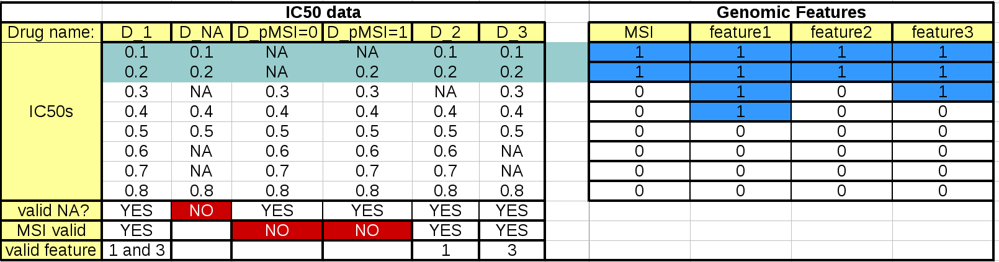

.. _anova_parttwo:

The ANOVA analysis in details
=================================

.. contents::

.. _settings:

About the settings
----------------------

When using the :class:`~gdsctools.anova.ANOVA` instance or the
:class:`~gdsctools.anova.ANOVAReport` to create an
HTML report (see :ref:`html`), all tunable settings are accessible from an
attribute called :attr:`settings`::

    from gdsctools import ANOVA, ic50_test
    gdsc = ANOVA(ic50_test)
    gdsc.settings

This :attr:`settings` attribute is an instance of :class:`gdsctools.settings.ANOVASettings`, which is fully documented in the reference. For example in the :ref:`HTML` section, we will change the default output **directory** where HTML pages are saved to a user-defined value.

It is also important to note that when calling ANOVAReport, the first argument
is an ANOVA instance that already contains the settings. So, ANOVAReport
will use that settings automatically (it may still be changed later). Consider this example::

    >>> from gdsctools import ANOVA, ic50_test, ANOVAReport
    >>> gdsc = ANOVA(ic50_test)
    >>> gdsc.settings.FDR_threshold = 15
    >>> results = gdsc.anova_all()

    >>> ar = ANOVAReport(gdsc, results)
    >>> ar.settings.FDR_threshold
    15

We will see more settings here below but first let us come back on the ANOVA
analysis.

.. _regression:

Regression analysis
-----------------------

By default, the regression uses an :term:`OLS` method. 4 Factors may be
taken into account depending on the content of the
:class:`~gdsctools.readers.GenomicFeature` data set.

Here below, we use the R syntax where C() stands for categorical data and Y is
the variable to be explained. Depending on the data and the
:class:`gdsctools.anova.settings` one of the following formula will be used:

.. math:: Y \sim C(tissue) + C(media) + C(MSI) + Feature

.. math:: Y \sim C(tissue) + C(MSI) + Feature

.. math:: Y \sim C(MSI) + Feature

.. math:: Y \sim Feature

Here are some rules applied:

- Feature factor is always included by definition and is in last position
- MSI and Media are included by default if found in the genomic feature data
  set. Note, however than one can exclude these factors using the
  :attr:`settings`.
- Tissue is included if there are more than 2 tissues. Again, one can
  change the :attr:`settings.analysis_type` to the name of the tissue (instead
  of PANCAN, the default value).

.. note:: The order of the different features in the equations may have an
    impact on the analysis.

Since analysis may be time-consuming, we have hard-coded the
regression formula. Note, however, that in version 0.16, we have
added the :meth:`~gdsctools.anova.ANOVA.anova_one_drug_one_feature_custom`
method, which can be use for any type of regression based on a user formula.
This is slower than the 4 hardcoded versions mentionned above but is
more flexible. One can for instance set the formula to specify the treatement
to be used as a reference::

.. versionchanged:: 0.16
  The regression method is the :term:`OLS` method. Other methods will be used in
  an independent module (regression) 

MSI factor
~~~~~~~~~~~~

MSI is always included by default.
However, you may exclude it by setting its value to False::

    settings.include_MSI_factor

If **MSI_FACTOR** column is not found in the Genomic Feature data set, the MSI factor will be excluded automatically and the parameter above set to False.

.. warning:: If you force the MSI factor to True wherease there
    is not enough data in the binary sets of the MSI factor, error
    will be raised.

MEDIA factor
~~~~~~~~~~~~~

If included in the genomic feature data set, MEDIA are included by default.
However, you may exclude it by setting its value to False::

    settings.include_MEDIA_factor

If **MEDIA_FACTOR** column is not found in the Genomic Feature data set,
the MEDIA factor will be set automatically to False.

Tissue factor
~~~~~~~~~~~~~~~~~

Another factor used in the regression (tissue) will
be automatically excluded if there is only one tissue (or none). If several
tissues are available, you can still exclude it from the regression analysis
by settings this parameter to anything different from the default value (PANCAN)::

    settings.analysis_type = PANCAN

Filtering
-----------

When performing the analysis for a given drug and feature, the regression may
not be performed if there is not enough statistics.

These parameters will influence the number of tests being performed (number of associations of drug vs feature in :meth:`~gdsctools.anova.ANOVA.anova_all`)::

    - minimum_nonna_ic50
    - MSI_feature_threshold
    - feature_factor_threshold

The first parameter indicates the minimum number of valid IC50 required for a given drug to be analysed. The current default value is 6.

The second parameter indicates the minimum size of the positive and negative
population when IC50 are filtered by MSI factor (defaults to 2).

The third parameter indicates the minimum size of the positive and negative
population when IC50 are filtered by Feature factor (defaults to 3).

This table summarizes the effect of these parameters:

The left hand side table mimics the IC50 data. The first column should and last
3 rows are not to be included in an IC50 matrix (see :ref:`Data`) but are added
here as annotations for the following discussions.

When the regression analysis is performed for a given drug and a given feature,
3 filters are applied. First, a minimum number of values is required (minimum_nonna_ic50 setting). Therefore, the drug is not analysed. The second check is performed with respect to the MSI values. A drug can be analysed only if (once NA have been discarded) the number of IC50s corresponding to positive and negative MSIs is greater or equal to **MSI_feature_threshold**.
In our example, the drugs in column **D_pMSI=0** and **D_pMSI=1** are therefore
discarded since they have zero and only one positive MSI, respectively.

Finally, similarly to the MSI check, a drug/feature association is analysed if
the number of IC50s corresponding to positive and negative feature is or equal
to **feature_factor_threshold**.

Multiple testing corrections
------------------------------

By default, the multiple testing correction  is based on
Benjamini–Hochberg (BH) method but it can be set to other methods using ::

    settings.pval_correction_method

.. seealso:: :class:`~gdsctools.stats.MultipleTesting` for details.

The multiple testing is performed globally across all drugs and all cell
lines.This parameter is stored in ::

    settings.pvalue_correction_level

By default it is set to *global*. Set it to *local* to keep the multiple
correction at the drug level (ODAF).

When you perform an ANOVA analysis, the multiple correction method is used to
populate the results column named ANOVA_FEATURE_FDR.

If you change your mind and wish to run the analysis with another method,
you do not need to re-run the entire analysis. Instead, simply change the
method's name and call :meth:`anova_all` again. Only the multiple testing computation is
performed, skipping ANOVA testing, which have already been done.

::

    results = an.anova_all()
    an.settings.pvalue_correction_method = 'qvalue'
    results = an.anova_all()

.. index:: volcano

volcano plots
-----------------

The volcano plots are one of the main results of the analysis and summarizes
visually the significance of the different associations.

It is part of the :class:`~gdsctools.anova_report.AnovaResults` class and is
returned either by an ODAF or ADAF analysis:

.. plot::
    :include-source:
    :width: 80%

    from gdsctools import ANOVA, ic50_test
    gdsc = ANOVA(ic50_test)
    res = gdsc.anova_all()
    res.volcano()

Here are some
parameters used to tune the plots and selection of significant events:

- **pvalue_threshold** is used to select significant hits. See :class:`~gdsctools.anova_report.ANOVAReport`.
- **effect_threshold** is used to select significant hits as well.
- **FDR_threshold**   is used in :class:`gdsctools.volcano.VolcanoANOVA`
  (horizontal lines)
- **volcano_FDR_interpolation** uses interpolation to plot the FDR lines in the
  volcano plot.
- **volcano_additional_FDR_lines** : [0.01, 0.1, 10]

.. seealso:: :class:`~gdsctools.volcano.VolcanoANOVA`.

others
----------

See :class:`~gdsctools.settings.ANOVASettings` for the full listing.

.. note:: Some settings will be set automatically when calling some functions.
    For instance, if you call :meth:`anova.ANOVA.set_cancer_type` to a single
    tissue, then the analysis_type will be set to the tissue's name. If there
    are not enough positive or negative MSI, the MSI factor will ignored.
