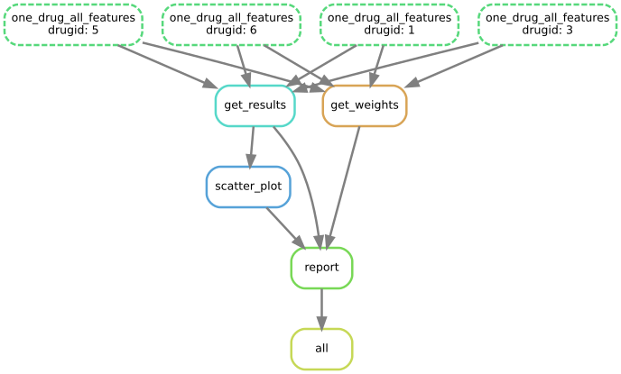

Regression analysis
========================

Since version 0.15, we have also the ability to perform a regression analysis at
the drug level (:term:`ODAF` mode).

The are currently 3 types of regression implemented:

#. Ridge
#. Lasso
#. Elastic Net

Information about functionalities implemented in GDSCTools are available 
in the reference :mod:`gdsctools.regression.` and in a notebook (see https://github.com/CancerRxGene/gdsctools/tree/master/notebooks) called Regression.

We first give some examples following information contained in the reference and
the notebook. In the example here below, the data sets are small. In practice,
you may have many features and would require a cluster to perform the
computation in a reasonable amount of time. We therefore develop a pipeline that
wraps up the analysis. The pipeline uses the Snakemake framework (see below).

Doing the analysis using GDSCTools library
-----------------------------------------------

As usual, we will use some data provided in GDSCTools in the form of ain IC50 data
set and a genomic features data set::

    from gdsctools import *
    ic50 = IC50(ic50_v17)
    gf = GenomicFeatures(gf_v17)

To decrease the computational time, let us select only genomic features that are
factors or mutations::

    gf.df = gf.df[[x for x in gf.df.columns if "FACTOR" in x or "mut" in x]]

Here, we will use the Lasso regression::

    lasso = GDSCLasso(ic50, gf)

For each drug, all features are taken and a regression is performed. For each
drug, we tune the **alpha** parameter using a cross validation (a K-fold CV).

.. note:: the regression implementation is based on scikit-learn. The **alpha**
   parameter is called **lambda** in the R glmnnet package. In the ElasticNet
   case, and additional parameter is called **l1_ratio** (0.5 by default)
   and correspond to the  glmnet parameter **alpha**.

Before, doing the tuning, let us choose one drug. Let us pick up an interesting
one::

    drugid = 1047

Tuning
~~~~~~~~~~~~

Users are able to choose the number of K-folds, which is set to 10 by default. 
Here is the method to call::

    res = lasso.runCV(drugid, kfolds=8)

The returned object contains the best alpha but also the pearson coefficient::

    res.alpha

From this parameter, the best model can be created and used for further
analysis, in particular to see the important features::

    best_model = lasso.get_model(alpha=res.alpha)
    weights = lasso.plot_weight(drugid, best_model)

.. plot::

    from gdsctools import *
    ic50 = IC50(ic50_v17)
    gf = GenomicFeatures(gf_v17)
    gf.df = gf.df[[x for x in gf.df.columns if "FACTOR" in x or "mut" in x]]
    lasso = GDSCLasso(ic50, gf)
    drugid = 1047
    res = lasso.runCV(drugid, kfolds=8)
    best_model = lasso.get_model(alpha=res.alpha)
    res = lasso.plot_weight(drugid, best_model)

Validation
~~~~~~~~~~~~~

The runCV function mentionned above does not plot any figures for optimisation
reasons. We implemented another function called **tune_alpha**, which has a
visual representation. This is however 20 time slower than **runCV** and is not
used in production.::

    lasso.tune_alpha(drugid, alpha_range=[-2.8,-0.5])

.. plot::

    from gdsctools import *
    ic50 = IC50(ic50_v17)
    gf = GenomicFeatures(gf_v17)
    gf.df = gf.df[[x for x in gf.df.columns if "FACTOR" in x or "mut" in x]]
    lasso = GDSCLasso(ic50, gf)
    drugid = 1047
    res = lasso.tune_alpha(drugid, kfolds=8, alpha_range=[-2.8,-0.5])

Another important function is the **check_randomness** method. It runs N times
the :meth:`gdsctools.regression.GDSCLAsso.runCV`  function, and N times the 
same analysis shuffling the Y
data. This creates a NULL model. The Pearson correlation values between the NULL
model and the real data is then compared using a Bayes factor metric
(independent of N).

boxplots
~~~~~~~~~~~

::

    boxplots = lasso.boxplot(drugid, model=best_model, n=10, bx_vert=False)

.. plot::

    from gdsctools import *
    ic50 = IC50(ic50_v17)
    gf = GenomicFeatures(gf_v17)
    gf.df = gf.df[[x for x in gf.df.columns if "FACTOR" in x or "mut" in x]]
    lasso = GDSCLasso(ic50, gf)
    drugid = 1047
    res = lasso.runCV(drugid, kfolds=8)
    best_model = lasso.get_model(alpha=res.alpha)
    boxplots = lasso.boxplot(drugid, model=best_model, n=10, bx_vert=False)

ADAF analysis
~~~~~~~~~~~~~~~~~~~
We have now a good picture of what the regression tools can do. If one wants to
play with ElasticNet or Ridge methods, just replaced GDSCLasso by 
GDSCElasticNet or GDSCRidge.

We now want to run the regression on all drugs. This can be done manually of
course using a loop over each drug identifiers::

    for drugID in lasso.drugIds:
        res = lasso.runCV(drugid, kfolds=8)
        best_model = lasso.get_model(alpha=res.alpha)
        weights = lasso.plot_weight(drugid, best_model)
        boxplots = lasso.boxplot(drugid, model=best_model, n=10, bx_vert=False)
        # Save images here

The snakemake pipeline
------------------------

.. warning:: This is only available for Python 3.5 users since the snakemake
   utility is only available for Python 3.

We provide a pipeline in a form of a snakemake file. The pipeline is called **regression.rules** 
and a config file named **regression.yaml** is also provided. 

The workflow looks like:

Imagine the case where you have 4 drugs, then results and weights are
computed for each drug. This is parallelised on a distributed-computer.
Once the computation is performed, a report is created.

The path of those files can be obtained using ::

    from gdsctools import gdsctools_data
    gdsctools_data("regression.rules", "../pipelines")
    gdsctools_data("regression.yaml", "../pipelines")

Those two files must be copied in a local directory.

Then, edit the config file that looks like::

    regression:
        method: lasso
        kfold: 10
        randomness: 50

    input:
        ic50:
        genomic_features:

so as to set the input IC50 and genomic_features files. Once done, you can run
the analysis. Just type::

    snakemake -s regression.rules -j 4

Or a cluster, you may add the following information (for instance on a slurm
system)::

    snakemake -s regression.rules -j 40 --cluster "sbatch --qos normal"

where -j 40 means uses 40 cores. Wait until it is finished. You should have an
index.html file at the end.

.. note:: There is a standalone that fetches the pipeline and its config file,
   autofilled with user's argument ready to run. The standalone is called
   **gdsctools_regression**. Please see :ref:`standalone` section
