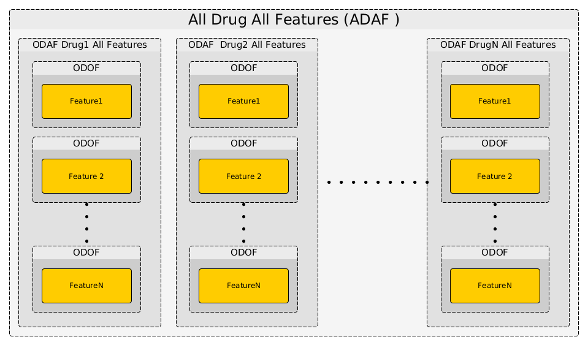

.. _quickstart:

Quick Start
=============

There are currently 3 ways to use **GDSCTools**:

#. Typing commands in a **Python shell**. That method is for **developers and users** who want to have high flexibility and use the **GDSCTools** to the best advantage.
#. Re-using **IPython Notebooks** available within the source code.
#. Using a **standalone application** called **gdsctools_anova**,
   which is the recommended version for **end-users**.

In this section we will focus on the first approach. This will also allow you to use IPython notebooks as explained in the :ref:`notebooks` section. The third approach is presented in the :ref:`standalone` section. The standalone application can be used to reproduce the following examples and will be used to produce **data packages**. In the parlance of **GDSCTools**, a data package is the results of an analysis together with an HTML report (see :ref:`data_packages` section).

We assume now that you have **gdsctools** installed together with **IPython**.
If not, please go back to the :ref:`installation` section.

.. note:: Instead of Python, we will use IPython, which is more flexible 
    and interactive that the original version. To start IPython, type this
    command in a terminal/shell::

        ipython

    You should now see something like::

        Python 2.7.5 (default, Nov  3 2014, 14:33:39) 
        Type "copyright", "credits" or "license" for more information.

        IPython 4.0.0 -- An enhanced Interactive Python.
        ?         -> Introduction and overview of IPython's features.
        %quickref -> Quick reference.
        help      -> Python's own help system.
        object?   -> Details about 'object', use 'object??' for extra details.

        In [1]: 

.. note:: All snippets in this documentation are typed within IPython shell. 
    You may see >>> signs. They indicate a python statement typed in 
    a shell. Lines without those signs indicate the output of the previous
    statement. For instance::

        >>> a = 3
        >>> 2 + a
        5

    means the code **2 + a** should print the value 5

The IC50 input data 
-------------------------------

Before starting, we first need to get a data file to play with. The only
required data file is one that contains :term:`IC50`.  
For now, we do not need to enter into the details of the expected data
structure; it should be a CSV or TSV file as in this :download:`IC50 example <../../share/data/test_IC50.csv>` file.

.. seealso:: More details about the data format can be found in the :ref:`data` section as well as links to retrieve IC50 data sets.

Although all functionalities could be imported using::

    from gdsctools import *

we will be as explicit as possible in the following examples; we would rather use (for instance)::

    from gdsctools import IC50

This is better coding practice and has also the advantage of telling beginners
which functions are going to be used. 

Here above, we imported the :class:`~gdsctools.readers.IC50` class, that allows one to read the IC50 example file aforementioned. We will explain in details the different data sets and their formats in the :ref:`data` section. However, for now it is enough to know that it should be a CSV formatted file that contains IC50s; one value for each combination of drug and cell line. 

Note that the IC50 example is also installed with **GDSCTools** and its location obtained using::

    from gdsctools import ic50_test
    print(ic50_test.filename)

The :class:`~gdsctools.readers.IC50` class is flexible enough that you can provide the filename location or just the name **ic50_test** as in the example below:: 

    >>> from gdsctools import IC50, ic50_test
    >>> ic = IC50(ic50_test)
    >> print(ic)
    Number of drugs: 11
    Number of cell lines: 988
    Percentage of NA 0.206569746043

As you can see you can get some information about the IC50 content (e.g., 
number of drugs, percentage of NaNs) using the :ref:`print` function. See :class:`gdsctools.readers.IC50` for more details.

Getting help
---------------

At any time, you can get help about a **GDSCTools** functionality or a python function by adding question tag after a function's name::

    IC50?

With **GDSCTools**, we also provide a convenience function called :func:`~gdsctools.gsdctools_help`::

    gdsctools_help(IC50)

that should open a new tab in a browser redirecting you to the HTML help version (on `ReadTheDoc website <gdsctools.readthedocs.org>`_) of a function or class (here the :class:`IC50` class).

    

The ANOVA class
----------------

Before starting, just a few words about the underlying stastistical analysis. On one hand, we have an IC50 file. It contains IC50s measured for :math:`N_d` drugs and :math:`N_c` cell lines. Each combination of drug and cell line has a unique measured IC50. On the other hand, one should also provide a data file with genomic features with the same set of :math:`$N_c$` cell lines. The other dimension being the :math:`N_f` genomic features (e.g. mutation). A default set of 680 genomic features is provided and automatically fetched in the following examples. 

.. seealso:: More details about the genomic features data format can be found in the :ref:`data` section.

The :class:`~gdsctools.anova.ANOVA` classs takes as input a compulsary IC50
filename (or data) and possibly a genomic features filename (or data). On the
previous IC50 test example, we create an ANOVA instance as follows::

    from gdsctools import ANOVA, ic50_test
    gdsc = ANOVA(ic50_test)

There are now several possible analysis but the core of the analysis consists
in taking one drug and one feature (ODOF hereafter) and to compute the
association using a regression analysis. The IC50 across the cell lines being
the dependent variable :math:`Y` and the explanatory variables denoted :math:`X` are made of tissues, :term:`MSI` and one genomic feature. following the regression analysis, we compute the ANOVA summary leading a p-value for the significance of the association between the drug's IC50s and the genomic feature considered. This calculation is performed with the :meth:`~gdsctools.anova.ANOVA.anova_one_drug_one_feature`. 

One can then repeat the ODOF analysis for all features using the
:meth:`~gdsctools.anova.ANOVA.anova_one_drug` (ODAF), and finally extend the analysis to all drugs (ADAF) using :meth:`~gdsctools.anova.ANOVA.anova_all`.

.. note:: P-values reported by the ODOF method need to be corrected with a
    multiple testing correction when combined in the ODAF or ADAF cases. 
    For more information, please see the :ref:`multitesting` section.

The following image illustrates how those 3 methods interweave together like
Russian dolls. 

The computational time is therefore increasing with the number of drugs and
features. Let us now perform the analysis for the 3 different cases.

One Drug One Feature (ODOF)
~~~~~~~~~~~~~~~~~~~~~~~~~~~~~

Let us start with the first case that is one drug one feature, which needs to be given by the user to the :meth:`~gdsctools.anova.ANOVA.anova_one_drug_one_feature` method. Here is an example:

.. plot::
    :include-source:

    from gdsctools import ANOVA, ic50_test
    gdsc = ANOVA(ic50_test)
    gdsc.anova_one_drug_one_feature('Drug_999_IC50', 
        'TP53_mut', show=True)

Here a set of boxplots are produced; one for each explanatory
feature considered (tissue, MSI, genomic feature). If there is only one tissue,
the corresponding explanatory variable is not used (nor the corresponding
boxplot). Similarly the MSI variable may be ignored.

In the first boxplot (feature variable), we see the IC50s being divided in two
populations (negative and positive features). Here all tissues are mixed. 

In the second boxplot, the tissue variable is explored; this is a decomposition
of the first boxplot across tissues.

Finally, the third boxplot shows the impact of the MSI factor. Here again,
tissues are mixed.

The output is a time series. It contains statistical information about the
association found between the drug and the feature. See for :class:`gdsctools.anova.ANOVAResults` for more details.

.. seealso:: :class:`gdsctools.anova` and :ref:`data_packages`.

One Drug All Features (ODAF)
~~~~~~~~~~~~~~~~~~~~~~~~~~~~~~~~

Now that we have analysed one drug for one feature, we could repeat the analysis for all features. However, we provide a method that does exactly that for us :

.. plot::
    :include-source:

    from gdsctools import ANOVA, ic50_test
    gdsc = ANOVA(ic50_test)
    df = gdsc.anova_one_drug('Drug_999_IC50')  
    
    # no plots were generated in the previous statement
    # so we need to do it. The API will be simplified in the future
    from gdsctools import VolcanoANOVA
    df = gdsc.add_pvalues_correction(df)
    v = VolcanoANOVA(df)
    v.volcano_plot_all()

.. note:: This method takes 4-10 seconds per drug depending on the 
    number of features.

Here, we have a different plot called a volcano plot provided in
the :mod:`gdsctools.volcano` module. To understand the x and y-axis, let us 
come back briefly on the previous analysis. The output produced was made of a set of statistical metrics including a p-value (coming from the ANOVA analysis) and a signed effect size (see :ref:`data` for details).

Assuming that the population of IC50s has been separated in positive and
negative sets (based on the genomic feature) denoted :math:`IC50_{pos}` and :math:`IC50_{neg}`, then the signed effect size :math:`\eta` is computed as follows:

.. math::

    \eta = \rm{sgn} ( \Delta) * Es(IC50_{pos}, IC50_{neg})

where 

.. math::

    \Delta = \overline{IC50_{pos}} - \overline{IC50_{neg}}

and  :math:`Es` is the effect size function based on the Cohens metric (see 
:func:`gdsctools.stats.cohens`).

In the volcano plot, the p-values reported in the individual p-values for a given drug and feature.  Due to the number of test performed, we have
more chance to pick a significant hit by pure chance. Therefore, p-values are corrected using for instance a BH method. Significance of associations should therefore be based on the FDR rather than p-values. The horizontal dashed lines shows several FDR thresholds. 

All Drug All Features (ADAF)
~~~~~~~~~~~~~~~~~~~~~~~~~~~~~

Here we compute the associations across all drugs and features. In essence, it
is the same analysis as the ODAF case but with more tests. In order to reduce
the computational time, in the following example, we restrict the analysis to
the breat tissue using :meth:`~gdsctools.anova.ANOVA.set_cancer_type` method.

.. plot::
    :include-source:

    from gdsctools import ANOVA, ic50_test
    gdsc = ANOVA(ic50_test)
    gdsc.set_cancer_type('breast')
    results = gdsc.anova_all()

    from gdsctools import VolcanoANOVA
    v = VolcanoANOVA(results.df)
    v.volcano_plot_all()

.. warning:: :meth:`anova_all` may take a long time to run 
    (e.g., 10 minutes, 30 minutes) depending on the number of drugs
    and features. We have a buffering in place. If you stop the analysis in the
    middle, you can start againa and previous ODAF analysis will be retrieved
    starting the analysis where you previously stopped. If this is not what you
    want, you need to call :meth:`reset_buffer`

The volcano plot here is the same as in the previous section but with more data
points. The output is the same as in the previous section with more
associations.

Learn more
-----------

.. todo:: section in progress

Follow those links to learn more about:

* Tune some of the :ref:`settings`.
* Creating HTML reports from the analysis: :ref:`html`.
* Data :ref:`data` .
* Standalone :ref:`standalone`.
* Notebooks :ref:`notebooks`.
* Data packages :ref:`data_packages`.

