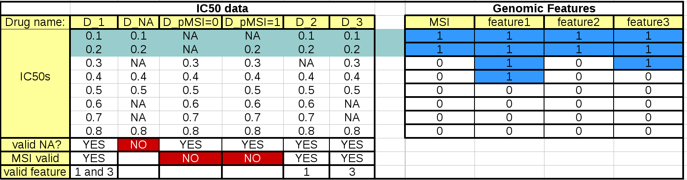

.. _settings:

Settings
===========

.. contents::

Overview
-----------

When using the :class:`~gdsctools.anova.ANOVA` instance or you 
when using the :class:`~gdsctools.anova.ANOVAReport` to create an
HTML report (see :ref:`html`), all tunable settings are accessible from an
attribute called :attr:`settings`::

    from gdsctools import ANOVA, ic50_test
    gdsc = ANOVA(ic50_test)
    gdsc.settings

This :attr:`settings` attribute is an instance of :class:`gdsctools.settings.ANOVASettings`, which is fully documented in the reference. 

In previous sections, we have already seen a few of the settings. For example in the :ref:`HTML` section, we changed the default **directory** where HTML pages are saved to a user-defined value. 

Let us introduce some of the most important concepts here below.

Regression analysis
-----------------------

The default regression method is the :term:`OLS` method. It is also the
recommended method. However, you can use Elastic Net, Ridge or Lasso::

    settings.regression.method = 'ElasticNet'
    settings.regression.method = 'Ridge'
    settings.regression.method = 'Lasso'
    settings.regression.method = 'OLS'

If you use anything else than OLS, you should then consider settings 1 or 2
additional settings::

    settings.regression.alpha
    settings.regression.L1_wt

See :class:`~gdsctools.anova.ANOVASettings` for details.

The regression analysis uses at most 4 factors: :term:`MSI`, Tissue, 
:term:`MEDIA` and Feature.  The latter is always included but others can be
tuned.

MSI factor
~~~~~~~~~~~~
If included in the genomic feature data set, MSI are included by default. 
However, you may exclude it by setting its value to False::

    settings.include_MSI_factor

If **MSI_FACTOR** column is not found in the Genomic Feature data set, the MSI factor will be excluded automatically and the parameter above set to False. 

MEDIA factor
~~~~~~~~~~~~~

If included in the genomic feature data set, MEDIA are included by default.
However, you may exclude it by setting its value to False::

    settings.include_MEDIA_factor

If **MEDIA_FACTOR** column is not found in the Genomic Feature data set, 
the MEDIA factor will be set automatically to False. 

Tissue factor
~~~~~~~~~~~~~~~~~

Another factor used in the regression (tissue) will
be automatically excluded if there is only one tissue (or none). If several
tissues are available, you can still exclude it from the regression analysis
by settings this parameter to anything different from the default value (PANCAN)::

    settings.analysis_type = PANCAN

Filtering
-----------

When performing the analysis for a given drug and feature, the regression may
not be performed if there is not enough statistics.

These parameters will influence the number of tests being performed (number of associations of drug vs feature in :meth:`~gdsctools.anova.ANOVA.anova_all`)::

    - minimum_nonna_ic50
    - MSI_feature_threshold
    - feature_factor_threshold
 
The first parameter indicates the minimum number of valid IC50 required for a given drug to be analysed. The current default value is 6.

The second parameter indicates the minimum size of the positive and negative
population when IC50 are filtered by MSI factor (defaults to 2). 

The third parameter indicates the minimum size of the positive and negative
population when IC50 are filtered by Feature factor (defaults to 3). 

This table summarizes the effect of these parameters:

The left hand side table mimics the IC50 data. The first column should and last
3 rows are not to be included in an IC50 matrix (see :ref:`Data`) but are added
here as annotations for the following discussions.

When the regression analysis is performed for a given drug and a given features,
3 filtering are performed using the 3 parameters aforementionned. First, 
a minimum number of values are required (minimum_nonna_ic50 setting). The second drug (D_NA) is therefore not analysed. The second check is performed with respect to the MSI values. A drug can be analysed only if (once NA are discarded) the number of IC50s corresponding to positive and negative MSIs is greater or equal to **MSI_feature_threshold**.
In our example, the drugs in column **D_pMSI=0** and **D_pMSI=1** are therefore
discarded since they have zero and only one positive MSI, respectively. 

Finally, similarly to the MSI check, a drug/feature association is analysed if
the number of IC50s corresponding to positive and negative feature is or equal
to **feature_factor_threshold**.

Mutiple testing corrections
------------------------------

By default, the multiple testing correction  is based on Benjamini–Hochberg (BH)
method and can be set to other methods using ::

    settings.pval_correction_method

.. seealso:: :class:`~gdsctools.stats.MultipleTesting` for details.

volcano plots
-----------------

The volcano plots are one of the main results of the analysis and summarizes
visually the significance of the different associations. Here are some
parameters used to tune the plots and selection of significant events:

- **pvalue_threshold** is used to select significant hits. See :class:`~gdsctools.anova_report.ANOVAReport`. 
- **effect_threshold** is used to select significant hits as well.
- **FDR_threshold**   is used in :class:`gdsctools.volcano.VolcanoANOVA`
  (horizontal lines)
- **volcano_FDR_interpolation** uses interpolation to plot the FDR lines in the
  volcano plot.
- **volcano_additional_FDR_lines** : [0.01, 0.1, 10]

.. seealso:: :class:`~gdsctools.volcano.VolcanoANOVA`.

others
----------

See :class:`~gdsctools.settings.ANOVASettings` for the full listing.

.. note:: Some settings will be set automatically when calling some functions.
    For instance, if you call :meth:`anova.ANOVA.set_cancer_type` to a single
    tissue, then the analysis_type will be set to the tissue's name. If there 
    are not enough positive or negative MSI, the MSI factor will ignored.
